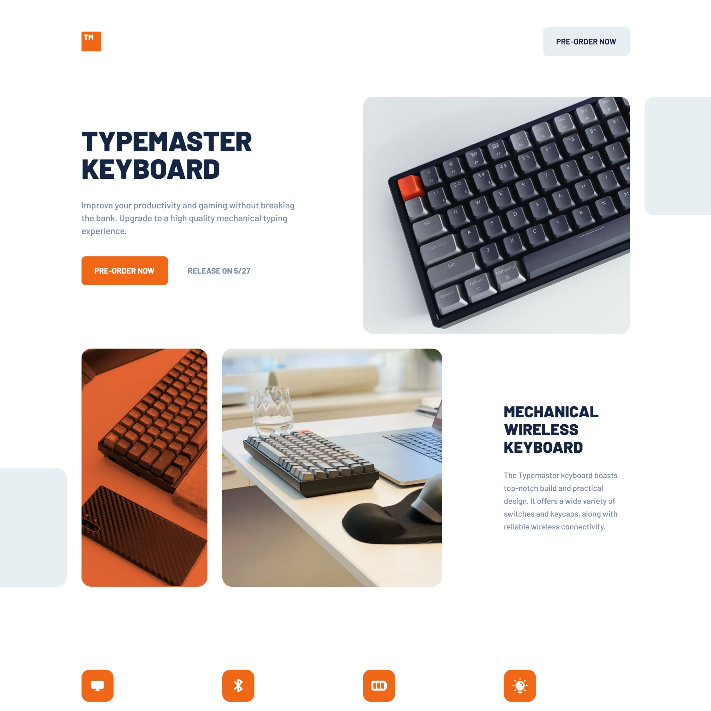

# Frontend Mentor - Typemaster pre-launch landing page solution

This is a solution to the [Typemaster pre-launch landing page challenge on Frontend Mentor](). Frontend Mentor challenges help you improve your coding skills by building realistic projects.

## Table of contents

- [Frontend Mentor - Typemaster pre-launch landing page solution](#frontend-mentor---typemaster-pre-launch-landing-page-solution)
  - [Table of contents](#table-of-contents)
  - [Overview](#overview)
    - [The challenge](#the-challenge)
    - [Screenshot](#screenshot)
    - [Links](#links)
  - [My process](#my-process)
    - [Built with](#built-with)
    - [What I learned](#what-i-learned)
    - [Continued development](#continued-development)
  - [Author](#author)

## Overview

### The challenge

Users should be able to:

- View the optimal layout depending on their device's screen size
- See hover states for interactive elements

### Screenshot



### Links

- Solution URL: [https://www.frontendmentor.io/solutions/typemaster-prelaunch-landing-page-using-css-grid-TKXLesneE3](https://www.frontendmentor.io/solutions/typemaster-prelaunch-landing-page-using-css-grid-TKXLesneE3)
- Live Site URL: [https://miguelzaga.github.io/typemaster-pre-launch-landing-page/](https://miguelzaga.github.io/typemaster-pre-launch-landing-page/)

## My process

### Built with

- Semantic HTML5 markup
- CSS custom properties
- Flexbox
- CSS Grid
- Mobile-first workflow

### What I learned

I learned a bit more about the property overflow. I was having trouble with the layout in the desktop version. I was able to solve it using: 

```css
html,
body {
    overflow-x: hidden;
}
```

At the beginning I was only applying it to the body element. By chance I applied on both and it worked.

### Continued development

I need to improve my grid, flexblox and general layout skills.

## Author

- Website - [Miguel Zapata](https://miguezaga.online/)
- Frontend Mentor - [@miguelzaga](https://www.frontendmentor.io/profile/miguelzaga)